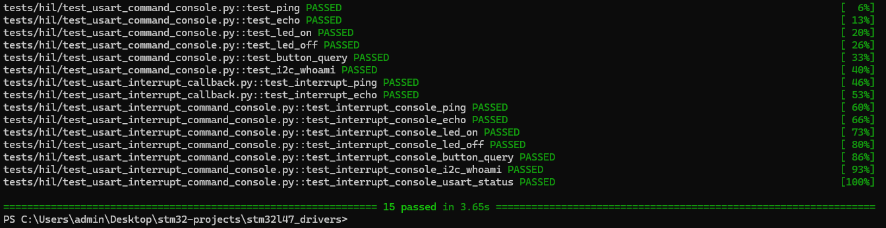

# Hardware-In-The-Loop Tests

This folder contains pytest-based HIL tests for the STM32L475 bare-metal driver examples.

The tests communicate with the board through the ST-LINK Virtual COM Port using `pyserial`. They send command strings to the firmware and validate the responses returned over USART.



## Run

```powershell
$env:STM32_PORT='COM4'
$env:STM32_BAUD='9600'
python -m pytest -m hil tests\hil -v
```

## Current Coverage

- USART command console: `PING`, `ECHO`, `LED ON`, `LED OFF`, `BUTTON?`, `I2C WHOAMI`
- USART interrupt callback validation
- Interrupt-driven USART command console
- USART status response

## Scope

These tests validate the PC-to-board command path and the firmware responses over USART. They do not directly prove every physical side effect unless the firmware response is backed by a measured hardware state or sensor feedback.

